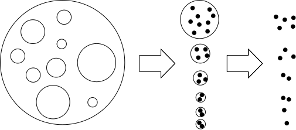
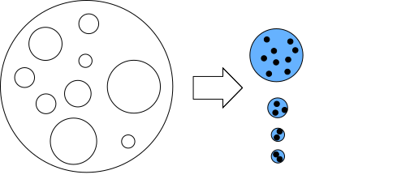

<!-- 参考:https://github.com/atusy/blog/blob/master/static/examples/2021-01-21-rmd-bs4/index.Rmd -->

```{r setup, include=FALSE}
library(knitr)
library(rmdformats)
library(svglite)

options(max.print="75")
opts_chunk$set(echo=TRUE,
               cache=FALSE,
               prompt=FALSE,
               tidy=FALSE,
               comment=NA,
               message=FALSE,
               warning=FALSE)
opts_knit$set(width=75)
opts_chunk$set(dev="svglite", fig.ext="svg")
```

## 統計調査士

### 主な基幹統計と作成主体

()内の数字は特に重要な基幹統計の数

- \*：**業務統計**
- \*\*：**加工統計**(二次統計)
- それ以外：**調査統計**

**内閣府** (1)  
<details>
<summary>
答え
</summary>

- **国民経済計算**<sup>\*\*</sup>

</details>

**総務省** (6)  
<details>
<summary>
答え
</summary>

- **国勢統計**
- **労働力統計**
- **就業構造基本統計**
- 個人企業経済統計
- 小売物価統計
- **家計統計**
- **全国家計構造統計**
- 住宅・土地統計
- 科学技術研究統計
- 社会生活基本統計
- 地方公務員給与実態統計
- **人口推計**<sup>\*\*</sup>

</details>

**厚生労働省** (4)  
<details>
<summary>
答え
</summary>

- **人口動態統計**<sup>\*</sup>
- **国民生活基礎統計**
- **毎月勤労統計**
- **賃金構造基本統計**
- 薬事工業生産動態統計
- 医療施設統計<sup>\*</sup>
- 患者統計
- 生命表
- 社会保障費用統計<sup>\*\*</sup>

</details>

**経済産業省** (1)  
<details>
<summary>
答え
</summary>

- 経済産業省生産動態統計
- 商業動態統計
- 石油製品需給動態統計
- 経済産業省企業活動基本統計
- 経済産業省特定業種石油等消費統計
- ガス事業生産動態統計
- **鉱工業指数**<sup>\*\*</sup>

</details>

**総務省・経済産業省** (1)  
<details>
<summary>
答え
</summary>

- **経済構造統計**

</details>

**総務省・内閣府ほか** (1)  
<details>
<summary>
答え
</summary>

- **産業連関表**<sup>\*\*</sup>

</details>

### 標本抽出方法

**単純無作為抽出**  
その名の通り。普通は使われない。

**系統抽出**  
母集団の構成要素全てに番号を振り、等間隔に抽出する。

**層化抽出**  
母集団をいくつかのグループ(層)に分け、各層から標本を抽出する。


**多段抽出**  
第1段階として集落を抽出し、第2段階として各集落から個体を抽出する。



**層化多段抽出**  
層化した後に多段抽出。

**集落抽出**  
集落をいくつか抽出し、その中の個体は全て調査する。



### データチェックの種類

|種類|内容|
|:---|:---|
|**オフコード・チェック**|定められている規定コード(男=1、女=2など)以外のコードが記入されていないか確認|
|**クロス・チェック**|調査事項間の関連性を見て、矛盾や不合理がないか確認|
|**シーケンス・チェック**|一連番号などが昇順または降順で並んでいるか、欠番がないか確認|
|**レンジ・チェック**|値に幅がある際に、あらかじめ上限・下限を設定し、記入内容が許容範囲にあるか確認|
|**トータル・チェック**|合計値が全体の値に一致するか確認|

### 価格指数

**ラスパイレス指数**  
<details><summary>数式</summary>

基準時点の購入量$q_{i0}$を重みに用いる。

$$
P_L = \frac{\Sigma_{i} p_{it} q_{i0}}{\Sigma_{i} p_{i0} q_{i0}}
$$

</details>
<br>

**パーシェ指数**  
<details><summary>数式</summary>

比較時点の購入量$q_{it}$を重みに用いる。

$$
P_P = \frac{\Sigma_i p_{it}q_{it}}{\Sigma_i p_{i0}q_{it}}
$$

</details>
<br>

**フィッシャー指数**  
<details><summary>数式</summary>

ラスパイレス指数とパーシェ指数の幾何平均。

$$
P_F = \sqrt{P_L \times P_P}
$$

</details>

## 専門統計調査士

### ネイマン割付

層化抽出において、統計量の分散を最小にするように各層のサンプルサイズを決める方法。

- $N$：母集団の全サンプルサイズ
- $N_h$：層$h$の全サンプルサイズ
- $n$：抽出したサンプルサイズ
- $n_h$：層$h$からのサンプルサイズ
- $\mu_h$：層$h$の母平均(or母比率)
- $\sigma_h$：層$h$に所属する個体の標準偏差
- $\hat{\mu}_h=\frac{1}{n_h}\sum_{k\in S_h}y_k$：$n_h$個のサンプルから計算した$\mu_h$の推定量


ウェイト$W_h=\frac{N_h}{N}$を使い、全体の母平均$\mu$を以下のように計算推定する。

$$
\hat{\mu} = \sum_{h}W_h\hat{\mu}_h
$$

このとき、$n=\sum_{h}n_h$の条件のもと、**$\hat{\mu}$の分散を最小にする$n_h$**は以下のようになる。

$$
n_h = n \frac{W_h\sigma_h}{\sum_{h}W_h\sigma_h}
$$

$\sigma_h$の値が前回調査などから分かっている場合、各層のサンプルサイズを上記のように設定する方法を**ネイマン割付(Neyman Allocation)**という。


### カバレッジ誤差

カバレッジ(=標本抽出枠が母集団をカバーしている割合)の不足or超過によって生じる推定量のバイアス



### 歪度・繊度

**歪度**

- 右裾が長い→**歪度は正**
- 左裾が長い→**歪度は負**

$$
sk = \frac{1}{n}\sum_{n}\left(\frac{x_i-\bar{x}}{s}\right)^3
$$

**尖度**

- 正規分布より尖っている→**尖度は正**
- 正規分布より平たい→**尖度は負**

$$
kr = \frac{1}{n}\sum_{n}\left(\frac{x_i-\bar{x}}{s}\right)^4-3
$$

### 数量化理論と多変量解析の対応表

|数量化理論|多変量解析|
|:---:|:---:|
|数量化1類|分散分析|
|数量化2類|判別分析|
|数量化3類|対応分析|
|数量化4類|多次元尺度法|

### 調査デザインの類型

||単一の母集団|複数の母集団|
|---:|:---:|:---:|
|**一時点**|横断的調査|比較調査|
|**異時点**|パネル調査|繰り返し調査|

### 調査法の種類

<table class="table table-condensed">
  <thead>
  <tr class="header">
    <th align="left">分類</th>
    <th align="left">調査法</th>
    <th align="left">詳細</th>
  </tr>
  </thead>
  <tbody>
  <tr>
    <td rowspan="2"><strong>他記式調査</strong></td>
    <td><strong>個別面接法</strong></td>
    <td>調査員が対象者本人と対面し質問する形式<ul><li>調査員の関与度合いが最も大きい調査</li><li>高い回収率が期待でき、量や複雑さに対して融通が効きやすい</li><li>なりすましや代理回答を防げる</li><li>質問の誤解や誤記入も発生しづらい</li><li>コストが最もかさむ</li><li>調査員間で習熟度や理解にバラツキが生じうる</li><li>プライベートなことが回答しにくいため回答が偏りやすい</li><li><strong>社会的望ましさバイアス</strong>がかかりやすい</li></ul></td>
  </tr>
  <tr>
    <td><strong>電話法</strong></td>
    <td>調査員が対象者に電話をかけ、質問をし得られた回答を書き留めていく調査<ul><li>調査が広範囲に渡っても迅速に実施できる</li><li>時間や金銭的コストを抑えられる</li><li>個別面接ほどの回収率は期待できない</li><li>込み入った内容の質問が難しい</li><li>代理回答のチェックが困難</li><li>社会的望ましさバイアスのような、個別面接と同様の偏りが生じやすい</li></ul></td>
  </tr>
  <tr>
    <td rowspan="4"><strong>自記式調査</strong></td>
    <td><strong>留置法</strong></td>
    <td>調査員が対象者を訪問して調査票への記入依頼を行い、後日回収する方法<ul><li>コストが抑えられ、高い回収率も期待できる</li><li>質問量について比較的融通が効く</li><li>曖昧なところを確認しながら回答できるため、一定期間の行動について聴取しやすい</li><li>プライベートな回答にも回答してもらいやすい</li><li>代理回答やなりすまし、誤解や回答ミスを防ぎにくい</li><li>複雑な質問は難しい</li></ul></td>
  </tr>
  <tr>
    <td><strong>郵送法</strong></td>
    <td>
      調査の依頼から配布、回収まで全て郵便で完結させる方法
      <ul>
        <li>圧倒的に安価で済む</li>
        <li>質問量に融通か効き、プライベートな事柄も聞きやすい</li>
        <li>なりすましや誤回答をチェックできない</li>
        <li>回答圧力がないため、<strong>回収率が著しく低くなる危険</strong>がある<br>(時代背景や方法論の確立により、近年では面接調査を上回る可能性があるとも言われている)</li>
      </ul>
    </td>
  </tr>
  <tr>
    <td><strong>集合法</strong></td>
    <td>
      対象者に特定の場所に集まってもらい、その場で調査票の配布・回収を行う方法
      <ul>
        <li>調査員によるバラツキは少ない</li>
        <li>誤記入や回答漏れを防げる</li>
        <li>質問量や複雑さも融通が効く</li>
        <li>安価に調査が可能</li>
        <li>そもそも対象者に集まってもらうのが難しく、また来てくれた人には何かしらの偏りがある可能性がある</li>
      </ul>
    </td>
  </tr>
  <tr>
    <td><strong>インターネット法</strong></td>
    <td>ウェブやメールにて調査依頼・回答・収集を行う方法
      <ul>
        <li>コストが抑えられ、Googleフォーム等の無料サービスも活用できる</li>
        <li>回答を中断可能なため、質問量は比較的融通が効く</li>
        <li>回答分岐の制御や矛盾チェックが機械的にできるので、回答精度は高い</li>
        <li>ポップアップ等を活用することで、複雑な質問も聴取しやすい</li>
        <li>データ入力作業がいらないので、時間短縮や労力削減が可能</li>
        <li>回答所要時間やOS・ブラウザ等の細かいデータも入手可能</li>
        <li>回収率は低くなりやすい</li>
        <li>調査会社のオンラインパネルを用いることが多いが、オンラインパネルが代表性を有しているかが明確でない</li>
      </ul>
  </tr>
  </tbody>
</table>


### 用語集

|用語|説明|
|:---|:---|
|**パネルの劣化**|パネルから対象者が徐々に脱落してしまうこと|
|**スクリーニング調査**|本調査の対象者を識別するための予備調査<br>本調査より多くの人に簡易的な質問を依頼する|
|**エディティング**|調査票に書かれた記述から、文字が薄い・回答が矛盾している等の問題点を解決し、入力すべき回答を確定させる作業|
|**アフターコーディング**|自由回答をもとに、調査者が事後的に回答を分類すること|
|**インスペクション**|訪問面接調査後に回答者に再接触し、調査員バイアスや、ミス・不正による事実でない回答を発見し、データへの混入を排除するための監査<br>(日本マーケティング・リサーチ協会では、「各調査作業の**最低10%**について検証を実施しなければならない」としている)|
|**初票点検**|各調査員の最初の回収原票を管理者が点検し、指示通りの形式で回答を得ているかどうかチェックすること|
|**メイキング**|調査員がなりすましで回答を記入し、不正を行うこと|
|**キャリーオーバー**|前に配置された設問や選択肢が、後半に配置された回答への影響を及ぼすこと|
|**ダブルバーレル**|1つの質問文の中に複数の聴取トピックがあることによって、回答者が困惑したり、回答がどのトピックに反応したかが曖昧になったりしてしまうこと|
|**サティスファイシング**|「この程度回答しておけばいいだろう」という回答者の回答態度|
|**ストレートライニング**|すべて同じ回答を選択・記入すること|
|**データリンケージ**|個人識別子を除去したデータセットでも、他のデータセットとの照合によって個人が特定されてしまうこと|
