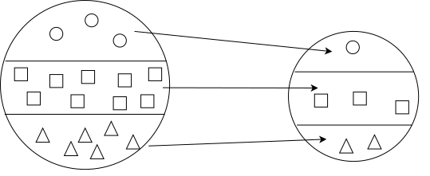

<!-- 参考:https://github.com/atusy/blog/blob/master/static/examples/2021-01-21-rmd-bs4/index.Rmd -->

```{r setup, include=FALSE}
library(knitr)
library(rmdformats)
library(svglite)

options(max.print="75")
opts_chunk$set(echo=TRUE,
               cache=FALSE,
               prompt=FALSE,
               tidy=FALSE,
               comment=NA,
               message=FALSE,
               warning=FALSE)
opts_knit$set(width=75)
opts_chunk$set(dev="svglite", fig.ext="svg")
```

## 統計調査士

### 主な基幹統計と作成主体

()内の数字は特に重要な基幹統計の数

- \*：**業務統計**
- \*\*：**加工統計**(二次統計)
- それ以外：**調査統計**

**内閣府** (1)  
<details>
<summary>
答え
</summary>

- **国民経済計算**<sup>\*\*</sup>

</details>

**総務省** (6)  
<details>
<summary>
答え
</summary>

- **国勢統計**
- **労働力統計**
- **就業構造基本統計**
- 個人企業経済統計
- 小売物価統計
- **家計統計**
- **全国家計構造統計**
- 住宅・土地統計
- 科学技術研究統計
- 社会生活基本統計
- 地方公務員給与実態統計
- **人口推計**<sup>\*\*</sup>

</details>

**厚生労働省** (4)  
<details>
<summary>
答え
</summary>

- **人口動態統計**<sup>\*</sup>
- **国民生活基礎統計**
- **毎月勤労統計**
- **賃金構造基本統計**
- 薬事工業生産動態統計
- 医療施設統計<sup>\*</sup>
- 患者統計
- 生命表
- 社会保障費用統計<sup>\*\*</sup>

</details>

**経済産業省** (1)  
<details>
<summary>
答え
</summary>

- 経済産業省生産動態統計
- 商業動態統計
- 石油製品需給動態統計
- 経済産業省企業活動基本統計
- 経済産業省特定業種石油等消費統計
- ガス事業生産動態統計
- **鉱工業指数**<sup>\*\*</sup>

</details>

**総務省・経済産業省** (1)  
<details>
<summary>
答え
</summary>

- **経済構造統計**

</details>

**総務省・内閣府ほか** (1)  
<details>
<summary>
答え
</summary>

- **産業連関表**<sup>\*\*</sup>

</details>

### 標本抽出方法

**単純無作為抽出**  
その名の通り。普通は使われない。

**系統抽出**  
母集団の構成要素全てに番号を振り、等間隔に抽出する。

**層化抽出**  
母集団をいくつかのグループ(層)に分け、各層から標本を抽出する。



**多段抽出**  
第1段階として集落を抽出し、第2段階として各集落から個体を抽出する。


**層化多段抽出**  
層化した後に多段抽出。

**集落抽出**  
集落をいくつか抽出し、その中の個体は全て調査する。


### 価格指数

**ラスパイレス指数**  
<details><summary>数式</summary>

基準時点の購入量$q_{i0}$を重みに用いる。

$$
P_L = \frac{\Sigma_{i} p_{it} q_{i0}}{\Sigma_{i} p_{i0} q_{i0}}
$$

</details>
<br>

**パーシェ指数**  
<details><summary>数式</summary>

比較時点の購入量$q_{it}$を重みに用いる。

$$
P_P = \frac{\Sigma_i p_{it}q_{it}}{\Sigma_i p_{i0}q_{it}}
$$

</details>
<br>

**フィッシャー指数**  
<details><summary>数式</summary>

ラスパイレス指数とパーシェ指数の幾何平均。

$$
P_F = \sqrt{P_L \times P_P}
$$

</details>

## 専門統計調査士


